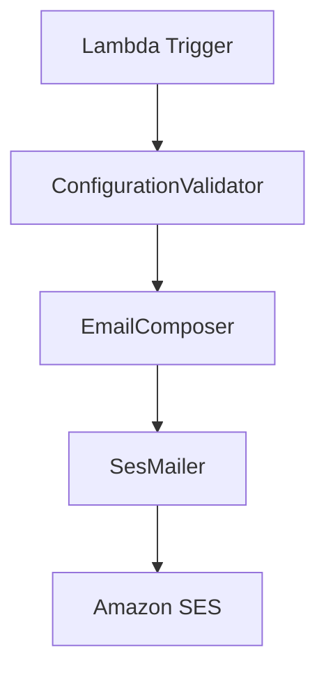

# AWS SES Error Notifier

[](https://opensource.org/licenses/MIT)

A serverless solution for handling message processing failures by sending formatted email notifications via Amazon SES.

## Disclaimer 
This code is the result of some intense Vibe Coding, so the most part of the boilerplate code is AI generated.

## 📋 Overview

This AWS Lambda function automatically sends detailed error notifications via email when message processing fails in:
- SQS queues
- Kinesis streams
- DynamoDB streams
- Other event sources

Designed for reliability and security, it provides human-readable error reports with full message context while maintaining data integrity through HTML sanitization.

## 🏗 Architecture

### Components


## Flow
Configuration Validation
ConfigurationValidator checks environment variables and email formats

**HTML Generation**
     EmailComposer creates sanitized HTML templates with error details

 **Email Delivery**
    SesMailer handles secure communication with AWS SES

**Error Handling**
    Custom exceptions with CloudWatch logging integration

## ✨ Features
    🔒 Secure HTML Templating with automatic content sanitization

    📧 Multi-recipient support with email validation

## 📊 Structured error reports including:

   - Message body

   - Attributes
     
   - System metadata

## 🛡 AWS Best Practices:

    Least privilege IAM roles

    Environment variable encryption

    SES sandbox mode support

## 📈 Observability:

    Detailed CloudWatch logs

    Success/failure metrics

    Error rate tracking

## 🚀 Getting Started
    Prerequisites
        - Java 11+

        - Maven 3.8+

        - AWS CLI v2

        - SAM CLI (optional)

Installation
```bash
git clone https://github.com/EricJoyBoy/aws-ses-error-notifier.git
cd aws-ses-error-notifier
mvn clean package
```

## 🔧 Configuration
Environment Variables
Variable	Description	Example
MAIL_SOURCE	Verified SES sender email	error@yourdomain.com
MAIL_DESTINATIONS	Comma-separated recipient list	ops@company.com,alerts@company.com
MAIL_SUBJECT	Email subject template	"[ERROR] Processing Failed - {timestamp}"
IAM Permissions
```json
{
    "Version": "2012-10-17",
    "Statement": [
        {
            "Effect": "Allow",
            "Action": [
                "ses:SendEmail",
                "ses:SendRawEmail"
            ],
            "Resource": "*"
        }
    ]
}
```

## 🧪 Testing
```json
{
    "Records": [
        {
            "messageId": "12345",
            "body": "{\"data\": \"sample payload\"}",
            "attributes": {
                "ApproximateReceiveCount": "3"
            },
            "messageAttributes": {
                "priority": {"dataType": "String", "stringValue": "high"}
            }
        }
    ]
}
```
**Local Testing**
```bash
sam local invoke -e test-event.json
```
 ## 📄 License
This project is licensed under the MIT License - see the LICENSE file for details.

## 🤝 Contributing
Fork the repository

Create feature branch (git checkout -b feature/improvement)

Commit changes (git commit -am 'Add new feature')

Push to branch (git push origin feature/improvement)

## Create Pull Request

⚠️ Important: Before deployment, ensure your SES identity is verified in the target AWS region.
🔐 Security Note: Always encrypt sensitive environment variables using AWS KMS.


